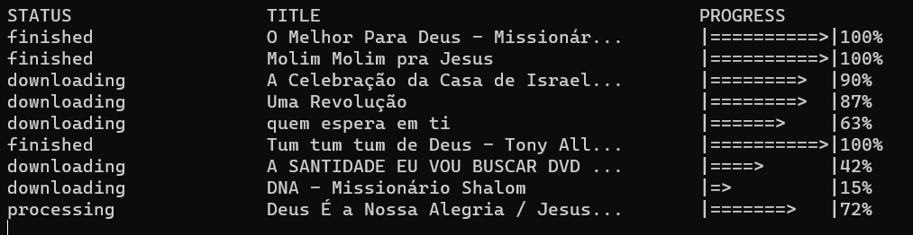

# YT Downloader!



Mais um projetinho saindo! Dessa vez é *um sistema de conversão e download de músicas a partir de uma playlist do YouTube*.

Baixar músicas é uma atividade que executo semanalmente e sempre quis automatizar de alguma forma 💡


## Como executar?

Antes de tudo, é necessário ter o *nodejs* instalado. Com o *nodejs* instalado, siga os passos:

```sh
# download do projeto
git clone https://github.com/flavionobredev/yt-downloader.git
cd yt-downloader

# baixar as dependências
npm install
```

Para executar, basta digitar no terminal: 
```sh
npm run start \
--playlist=LINK_DA_PLAYLIST_AQUI \
--name="NOME_DA_PASTA_DESTINO"
```

A aplicação irá converter e baixar o arquivo, que estará disponível na pasta `downloads`.

**Parâmetros**

| Opção | Tipo | Descrição
| --- | --- | ----------- |
| --playlist | *string* | Obrigatório. Link da playlist pública que deseja baixar.
| --name | *string* | Opcional. Nome da pasta onde será salvo. (Default: "Playlist 25-06-2022-13-30-12")
| --max-concurrency | *number* | Opcional. Máximo permitido para downloads simultâneos. (Default: 4)


> Nota: a finalidade desse projeto é apenas para servir como uma solução rápida para um problema atual. Contudo, quem sabe, ele não evolui para uma cli em Go!? 😁

<br>

## Pontos Principais

A aplicação atual foi feita utilizando baaaastante o *event loop* do *nodejs*, além de contar com poderosas ferramentas, como:
- *Events*: trabalhando com eventos;
- *Streams*: baixando um arquivo e, a cada parte, já salvando no destino;
- *Timers*: trabalhando com lógica de timers para verificação de status e logs.

A aplicação ainda contém uma *feature* de downloads simultâneos controlados! Permitindo, então, uma melhor utilização dos recursos, gerando mais eficiência no processo.